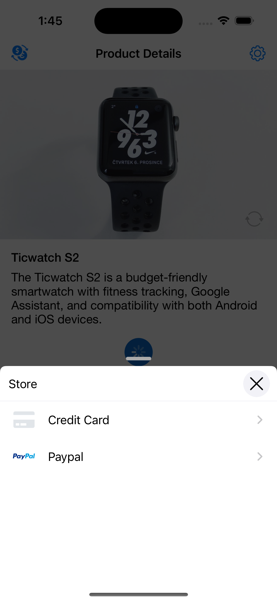
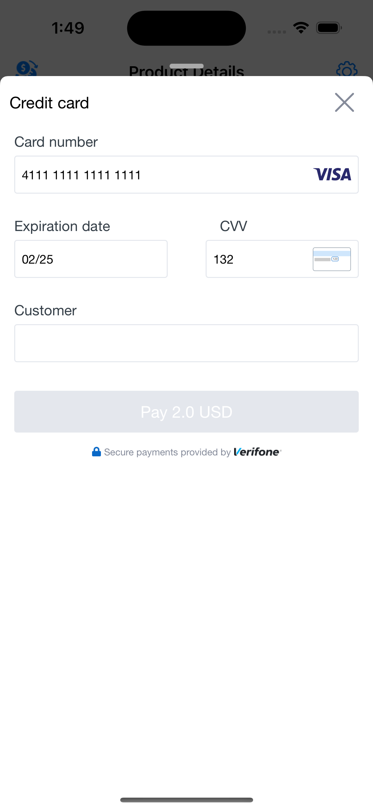

# 2Checkout iOS SDK

The 2Checkout SDK is designed to be easy to integrate into your application. With the 2Checkout SDK, you can easily tokenize card details, handle 3D Secure verification, and authorize PayPal payments.

     

### Requirements

- Xcode 10.2 or higher
- Swift 5.0 or higher
- iOS 12 or higher

### Suppported Payment Methods

- Credit Card Tokenization
- 3D Secure Authorization
- Paypal Payment Authorization

### Installation

2Checkout SDK is available through either CocoaPods and Carthage.

##### CocoaPods

1. Add the following line to your Podfile: `pod 'Verifone2CO', :git => ''`
2. Run `pod install`

##### Carthage

To integrate the VerifoneSDK into your Xcode project using Carthage, proceed with the following steps:

1. Add the following line to your Cartfile: `github "" "main"`
2. Run `carthage update --use-xcframeworks`
3. Link the frameworks with your target as described in [Carthage Readme](https://github.com/Carthage/Carthage#adding-frameworks-to-an-application).


### Usage

To set up the 2Checkout SDK, you will need to provide the following parameters:

1. Your unique 2Checkout supplied merchant code.
2. The total amount of the payment, which must be specified as a string with a currency code.
3. Language Code is the language in which you wish to display card form.
4. Allowed Payment Methods: This is a list of payment methods that are allowed for the payment.
5. Store title that will be displayed on the payment selection view.

```swift
let paymentConfiguration: Verifone2CO.PaymentConfiguration = Verifone2CO.PaymentConfiguration(
            delegate: self,
            merchantCode: "VENDOR_CODE",
            paymentPanelStoreTitle: "Store",
            totalAmount: "$10.99",
            allowedPaymentMethods: [.creditCard, .paypal])
Verifone2CO.locale = Locale(identifier: "en")
Verifone2COPaymentForm.present(with: paymentConfiguration, from: self)
```

The PaymentFlowSessionDelegate protocol provides four functions that allow you to observe the payment process:

paymentFormComplete: This function is called when the payment process has been completed, either successfully or with an error. When using the credit payment method, this function will return a EES token for the card data.

paymentFormWillShow: This function is called when the payment form is about to be displayed.

paymentFormHideShow: This function is called when the payment form is about to be hidden.

paymentMethodSelected: This function is called when a payment method has been selected.

```swift
extension ViewController: PaymentFlowSessionDelegate {
    func paymentFormComplete(_ result: Result<PaymentFormResult, Error>) {
        switch result {
        case .success(let result):
            // result.isCardSaveOn: Bool
            // result.token: String
            // result.paymentMethod: PaymentMethodType (creditCard, paypal)
            switch result.paymentMethod {
                case .creditCard:
                    /// make 2Checkout API call to create an order with the received token
                    /// https://app.swaggerhub.com/apis-docs/2Checkout-API/api-rest_documentation/6.0#/Order/post_orders_
                    /// If the create order response includes payment details with the "Authorize3DS" field, 
                    /// you can authorize the 3DS payment using the Verifone2COPaymentForm.authorizePayment method. 
                    /// This method takes three parameters: webConfig, delegate, and from.
                    let webConfig = VFWebConfig(url: "URL",
                                                    parameters: ["Required parameters"],
                                                    expectedRedirectUrl: ["expectedReturnURL"],
                                                    expectedCancelUrl: ["expectedCancelURL"])
                    Verifone2COPaymentForm.authorizePayment(webConfig: webConfig, delegate: self, from: self)
                case .paypal:
                    /// make 2Checkout API call to create an order with type Paypal
                    /// https://app.swaggerhub.com/apis-docs/2Checkout-API/api-rest_documentation/6.0#/Order/post_orders_
                    /// authorize a PayPal payment using the Verifone2COPaymentForm.authorizePayment method, 
                    /// you will need to use the redirect URL that was returned in the create order response.
                    let webConfig = VFWebConfig(url: "RedirectURL",
                                                    parameters: ["Required parameters"],
                                                    expectedRedirectUrl: ["expectedReturnURL"],
                                                    expectedCancelUrl: ["expectedCancelURL"])
                    Verifone2COPaymentForm.authorizePayment(webConfig: webConfig, delegate: self, from: self)
            }
            
        case .failure(let error):
            // Verifone2CoError
            print("Payment failed with error: \(error)")
        }
    }

    func paymentFormWillShow() {
        /// Handle payment form being displayed
        print("Payment form will be displayed")
    }
    
    func paymentFormWillClose() {
        /// Handle payment form being hidden
        print("Payment form will be hidden")
    }

    func paymentMethodSelected(_ paymentMethod: PaymentMethodType) {
        /// Handle payment method selection
        print("Selected payment method: \(paymentMethod)")
    }
}
```

To handle the completion or cancellation of the payment authorization process, you can implement the VF2COAuthorizePaymentControllerDelegate protocol and use the authorizePaymentViewController(didCompleteAuthorizing result: PaymentAuthorizingResult) and authorizePaymentViewControllerDidCancel methods.

```swift
extension ViewController: VF2COAuthorizePaymentControllerDelegate {
    func authorizePaymentViewController(didCompleteAuthorizing result: PaymentAuthorizingResult) {
        // result.redirectedUrl: URL
        // result.queryStringDictionary: NSMutableDictionary
        /// make an API call to check the status of the order
    }

    func authorizePaymentViewControllerDidCancel() {
        /// Payment authorization was cancelled 
    }
}
```

##### Card tokenisation without UI

```swift
let card = Card(name: "John Doe", creditCard: "4111111111111111", cvv: "123", expirationDate: "02/28")
Verifone2COPaymentForm.createToken(merchantCode: merchantCode, card: card, completion: { token, error in
    // token.token: Token string
    // error: Verifone2CoError
})
```

##### Customize the card form

Configure default theme properties for a credit card form.

```swift 
Verifone2CO.Theme.defaultTheme.primaryBackgroundColor = UIColor.grey
```

List of properties for customizing the credit card form.

N | PROPERTY NAME | DESCRIPTION  
| --- | --- | --- |  
1 | primaryBackgorundColor | Card form view background color |
2 | textfieldBackgroundColor | Background color for any text fields in a card form |
3 | textfieldTextColor | Text color for any text fields in a card form |
4 | labelColor | Text color for any labels in a card form |
5 | payButtonBackgroundColor | Pay button background color |
6 | payButtonDisabledBackgroundColor | Pay button background color for disabled state |
7 | payButtonTextColor | Pay button text color |
8 | cardTitleColor | Card form title color |